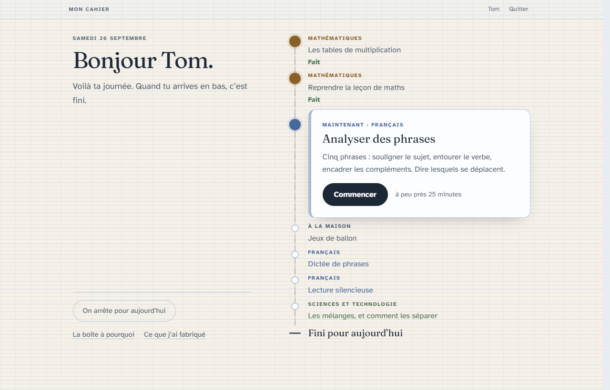
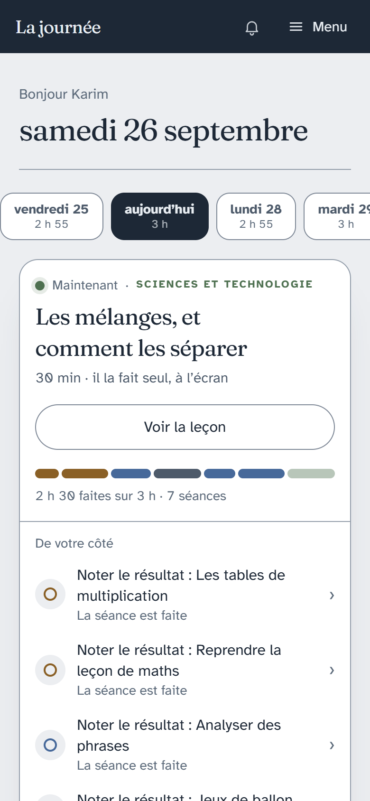
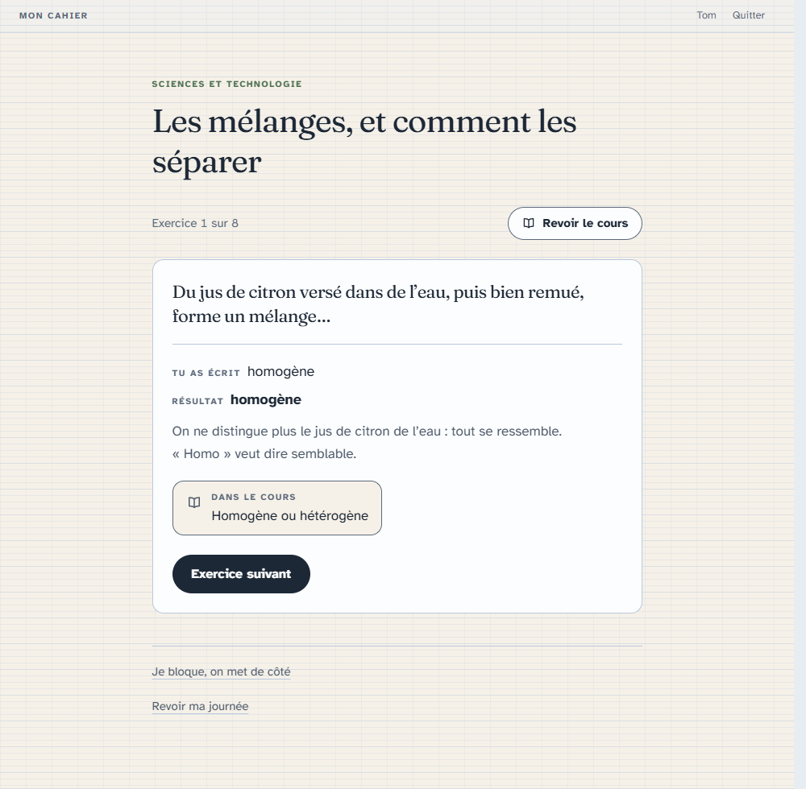

# Le cahier du jour

**La journée d'école d'un enfant instruit en famille — sans note, sans rouge,
sans compteur.**

  

Le cahier du jour organise l'**instruction en famille** d'un élève de **CM1**.
Chaque matin, l'enfant ouvre sa journée et la suit, étape par étape. Ses
parents la préparent et la corrigent depuis leur téléphone, mènent les
séances qui ne passent pas par un écran, et savent le soir ce qui a été fait.

Il est né dans une famille, pour un enfant que le sentiment d'échec met en
danger. Il est publié pour les familles qui vivent la même chose.

## Ce qu'il fait

**Pour l'enfant**
- sa journée comme un chemin, avec une fin qu'il voit dès le matin ;
- les leçons à l'écran, puis les exercices : il écrit sur papier et ne tape
  que le résultat ;
- après chaque réponse, le résultat et la façon de faire — **les mêmes,
  qu'il ait juste ou faux** ;
- « on arrête là » à tout moment, sans avoir à se justifier ;
- le soir, il dit comment il se sent, et seuls ses parents le lisent.

**Pour les parents, depuis leur téléphone**
- une journée proposée chaque jour d'après le plan de l'année, qu'on retouche
  quand on veut : retirer, ajouter, déplacer, alléger ;
- une fiche pour chaque séance qu'on mène soi-même — la dictée, le calcul
  mental, la lecture, le dehors — avec le matériel exact et le corrigé ;
- une cloche discrète quand une leçon mérite d'être reprise ;
- le relevé à remettre au soignant, et la vue à ouvrir le jour de
  l'inspection.

  
  &nbsp;&nbsp;
  

**Tout le CM1 est écrit** : 113 leçons, 854 exercices, 801 fiches, un test
de positionnement de 180 questions, et l'année entière posée jour par jour,
vacances comprises.

## Ce qu'il ne fera jamais

Aucun score, aucun pourcentage, aucune barre de progression du côté de
l'enfant. Aucun retard visible pour lui. Aucun rouge, nulle part. Aucun bon
point, badge ou confetti — la chaleur de l'interface ne dépend pas de ses
réussites. Ces règles sont tenues dans le code, et les tests les vérifient :
[les onze règles de conception](docs/regles.md).

## L'installer

Le cahier se **héberge soi-même**, sur un petit serveur loué (autour de 5 €
par mois) avec un nom de domaine. Ce que votre enfant écrit reste chez vous.
Il faut une heure, et quelqu'un à l'aise avec un terminal :
[la marche à suivre](deploiement/README.md).

**Avant de vous lancer**, lisez [les limites](docs/limites.md) : CM1
seulement, calendrier 2026-2027 de la zone B, et un contenu qui n'a encore
été relu par aucun enseignant.

## En savoir plus

Le [journal de conception](docs/README.md) raconte chaque écran et
**pourquoi** il est ainsi — c'est la partie la plus utile à qui voudrait
l'adapter à un autre enfant.

## Échanger

- Une question, une idée, une expérience à partager : les
  [Discussions](https://github.com/PierreTzt/cahier-du-jour/discussions).
- Une erreur dans une leçon, un bug : les [Issues](https://github.com/PierreTzt/cahier-du-jour/issues).

Tout y est public. **N'y écrivez jamais le prénom de votre enfant, ni rien de
sa santé ou de son suivi.**

## Licence

Gratuit pour les familles, les associations et les écoles ; **aucun usage
commercial**. Le code est sous [PolyForm Noncommercial 1.0.0](LICENSE.md), le
contenu pédagogique sous [CC BY-NC-SA 4.0](LICENCE-CONTENU.txt) — le détail
dans [LICENCES.md](LICENCES.md).
